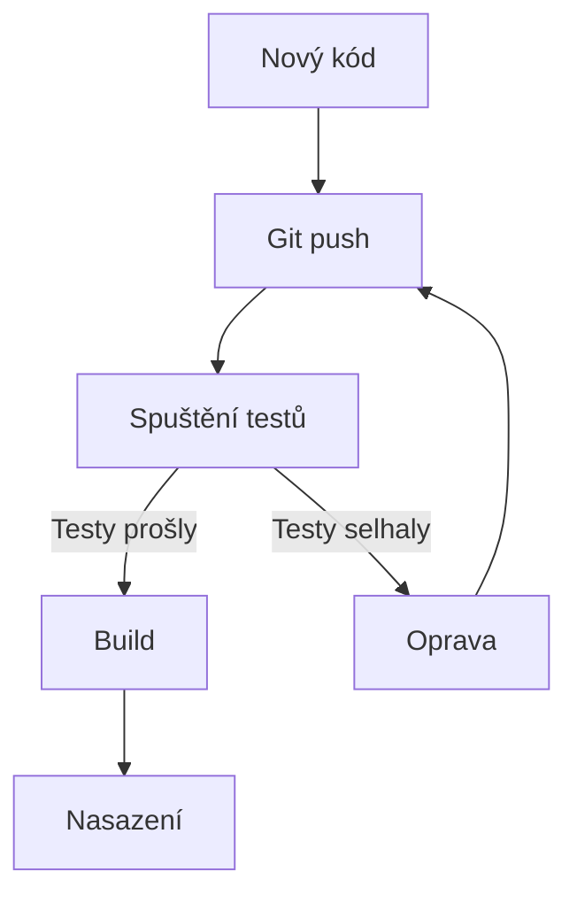
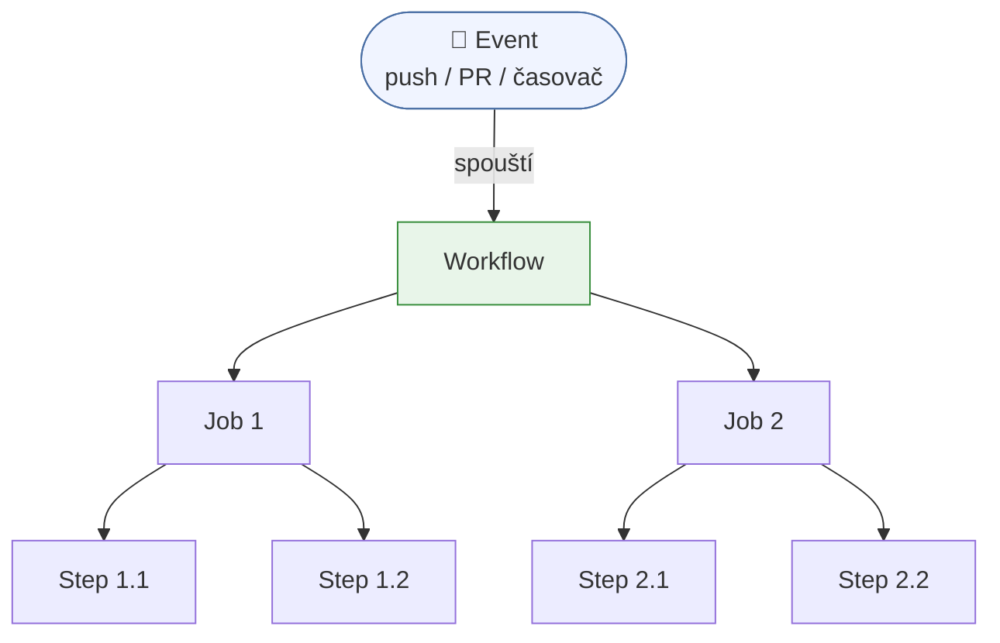
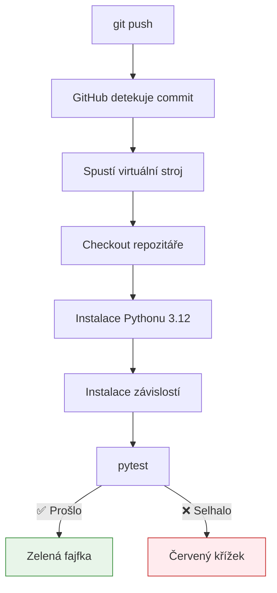
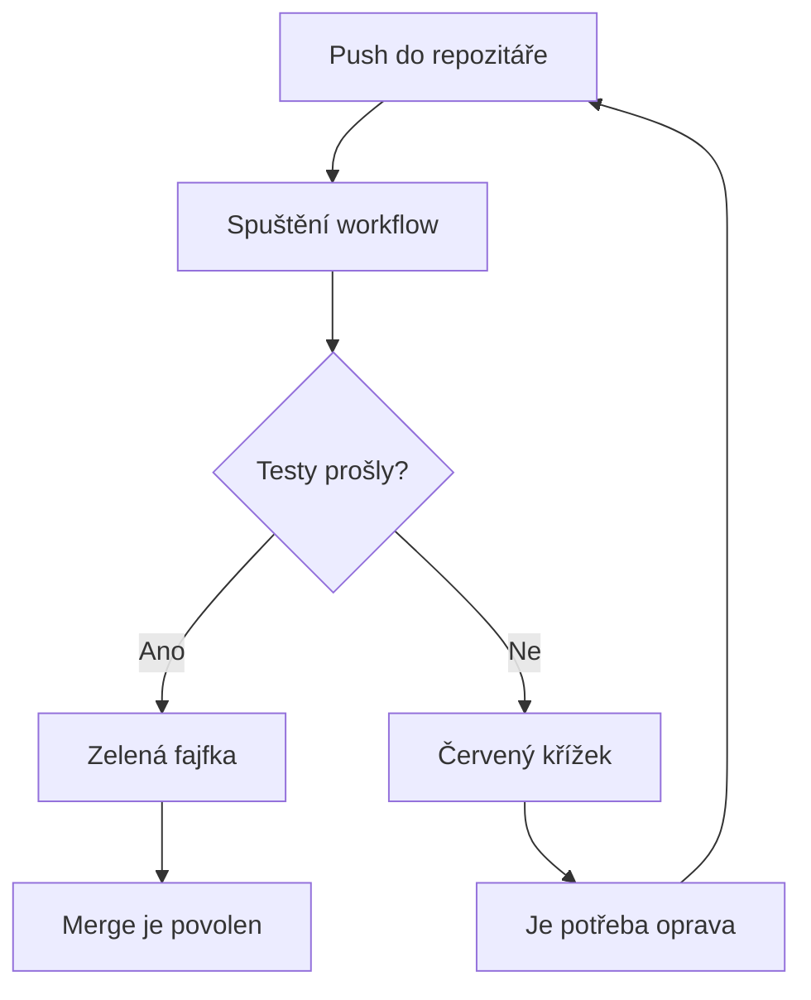

---
#== Layout
theme: default
background: https://cover.sli.dev # https://unsplash.com/collections/94734566/slidev
transition: slide-left #https://sli.dev/guide/animations#slide-transitions
mdc: true # https://sli.dev/guide/syntax#mdc-syntax
selectable: false
codeCopy: false
download: true
hideInToc: true

#== Code Highlighter
highlighter: shiki
lineNumbers: true

#== Dravings https://sli.dev/guide/drawing
drawings:
  persist: false

#== Export Configuration
# use export CLI options in camelCase format https://sli.dev/guide/exporting.html
export:
  format: pdf
  timeout: 30000
  dark: false
  withClicks: false

#== Slide Info
src: '../../pages/index.md'
title: "Pokročilé testování a CI/CD"
exportFilename: "38_testovani_actions"
titleTemplate: "PVA2 %s by Adam Fišer"
info: |
  ## PVA2 Programování a vývoj aplikací

  Určeno pouze pro výukové účely

  [Repository](https://github.com/OA-PVA2-Syllabus/pva2_prednasky) / [Prezentace](https://oa-pva2-syllabus.github.io/pva2_prednasky/)

  Created by [Adam Fišer](https://github.com/AdamFiser)
---
layout: default
---

#  Obsah

<Toc :columns="2" minDepth="1" maxDepth="1"></Toc>
---

# Úvod

- Co je CI/CD?
- Závislosti
- Seznámení s GitHub Actions
- Konfigurace GitHub Actions pro pytest
- Využití dekorátorů `@pytest.fixture` a `@pytest.mark.parametrize`
- Praktické ukázky

> 💡 **Bez CI/CD kontroluješ kód ručně — a to tě bude bolet.**

---

# Co je CI/CD?

<div class="grid grid-cols-2 gap-4">
<div>

## Continuous Integration (CI)
- Automatické testování každé změny
- Rychlá zpětná vazba při vývoji
- Prevence regresí (nových chyb)

## Continuous Delivery (CD)
- Automatické nasazování změn
- Konzistentní proces nasazení
- Méně manuálních chyb

</div>
<div>



</div>
</div>

---
layout: image-left
image: https://cover.sli.dev
---
# Závislosti

---
 
# Závislosti (dependencies)
 
<div class="grid grid-cols-2 gap-4">
<div>
 
## Co jsou závislosti?
- Externí knihovny, které tvůj kód potřebuje ke spuštění
- Nejsou součástí standardní Pythonu — musíš je doinstalovat
- Příklady: `pytest`, `requests`, `flask`, `numpy`

**Proč je to důležité pro CI/CD?**
- Virtuální stroj v GitHub Actions **nemá nic předinstalováno**
- Závislosti musíme nainstalovat jako jeden z prvních kroků workflow

</div>
<div>

## Jak se instalují?
```bash
# Instalace jedné knihovny
pip install pytest
 
# Instalace více najednou ze souboru
pip install -r requirements.txt
```
 
## Soubor `requirements.txt`
- Textový soubor se seznamem závislostí projektu
- Každá knihovna na samostatném řádku
- Volitelně s uvedením verze
 
```text
pytest
pytest-cov
requests>=2.28.0
flask==3.0.0
```
 
> 💡 `requirements.txt` **patří do repozitáře** — bez něj GitHub Actions neví, co nainstalovat.
 
</div>
</div>

---
layout: image-left
image: https://cover.sli.dev
---
# GitHub Actions

---

# Seznámení s GitHub Actions

<div class="grid grid-cols-2 gap-4">
<div>

## Co je GitHub Actions?
- Služba pro automatizaci workflow
- Integrovaná přímo v GitHubu
- Konfigurace pomocí YAML souborů
- Spouštění na různých událostech (push, pull request)

## Výhody
- Zdarma pro open-source projekty
- Široká nabídka předpřipravených akcí
- Jednoduchá integrace s GitHub repozitáři

</div>
<div>

```yaml
name: Python tests

on:
  push:
    branches: [ main ]
  pull_request:
    branches: [ main ]

jobs:
  test:
    runs-on: ubuntu-latest
    steps:
    - uses: actions/checkout@v3
    - name: Set up Python
      uses: actions/setup-python@v4
      with:
        python-version: '3.12'
    - name: Run tests
      run: |
        pip install pytest
        python -m pytest
```

</div>
</div>

<!--
Jak číst yaml
1. name - Nejprve zjistím, jak se workflow jmenuje v GitHub Actions.
2. on - Potom hledám, kdy se workflow spustí. Tady po push a při pull_request na větev main.
3. jobs - Workflow obsahuje jeden job s názvem test.
4. runs-on - Job poběží na Linuxu (ubuntu-latest).
5. steps - Nakonec sleduji jednotlivé kroky, které se provedou za sebou.
-->

---

# Základní terminologie GitHub Actions

<div class="grid grid-cols-2 gap-4">
<div>

### Workflow
- Celý automatizovaný proces
- Definovaný v YAML souboru

### Event
- Spouštěcí událost (push, PR, časovač)

### Job
- Jednotlivá práce v rámci workflow
- Běží na vlastním virtuálním stroji

### Step
- Krok v rámci jednoho jobu
- Akce nebo příkaz

</div>
<div>



</div>
</div>

---

# Konfigurace GitHub Actions pro pytest

<div class="grid grid-cols-2 gap-4">
<div>

## Vytvoření workflow souboru
1. Vytvořte adresář `.github/workflows`
2. Vytvořte soubor, např. `pytest.yml`
3. Definujte workflow
4. Push do repozitáře

## Obsah konfigurace
- Událost spuštění
- Virtuální prostředí
- Kroky pro instalaci závislostí
- Krok pro spuštění testů

</div>
<div>

```yaml {*}{maxHeight:'400px'}
name: Python tests

on:
  push:
    branches: [ main ]
  pull_request:
    branches: [ main ]

jobs:
  test:
    runs-on: ubuntu-latest
    steps:
    - uses: actions/checkout@v3
    - name: Set up Python
      uses: actions/setup-python@v4
      with:
        python-version: '3.12'
    - name: Install dependencies
      run: |
        python -m pip install --upgrade pip
        if [ -f requirements.txt ]; then pip install -r requirements.txt; fi
        pip install pytest pytest-cov
    - name: Test with pytest
      run: |
        pytest --cov=./ --cov-report=xml
```

</div>
</div>

---
layout: image-left
image: https://cover.sli.dev
---

# První praktická ukázka

---

# Struktura projektu

Mějme jednoduchý projekt s následující strukturou:

```
my_project/
├── .github/
│   └── workflows/
│       └── pytest.yml
├── src/
│   ├── __init__.py
│   └── calculator.py
├── tests/
│   ├── __init__.py
│   └── test_calculator.py
├── requirements.txt
└── README.md
```

> Všechny naše nově vytvořené anebo upravené projekty **budou dodržovat tuto strukturu**.

---

# Zdrojový kód `calculator.py`

```python
class Calculator:
    def add(self, a, b):
        return a + b
    
    def subtract(self, a, b):
        return a - b
    
    def multiply(self, a, b):
        return a * b
    
    def divide(self, a, b):
        if b == 0:
            raise ValueError("Nelze dělit nulou")
        return a / b
```

---

# Testovací kód `test_calculator.py`

```python {*}{maxHeight:'400px'}
import pytest
from src.calculator import Calculator
 
 
@pytest.fixture
def calc():
    return Calculator()
 
 
@pytest.mark.parametrize("a, b, expected", [
    (1, 2, 3),
    (-1, 1, 0),
    (-1, -1, -2),
])
def test_add(calc, a, b, expected):
    assert calc.add(a, b) == expected
 
 
@pytest.mark.parametrize("a, b, expected", [
    (3, 2, 1),
    (1, 1, 0),
    (-1, -1, 0),
])
def test_subtract(calc, a, b, expected):
    assert calc.subtract(a, b) == expected
 
 
@pytest.mark.parametrize("a, b, expected", [
    (2, 3, 6),
    (-2, 3, -6),
    (-2, -3, 6),
])
def test_multiply(calc, a, b, expected):
    assert calc.multiply(a, b) == expected
 
 
@pytest.mark.parametrize("a, b, expected", [
    (6, 3, 2),
    (-6, 3, -2),
    (-6, -3, 2),
])
def test_divide(calc, a, b, expected):
    assert calc.divide(a, b) == expected
 
 
def test_divide_by_zero(calc):
    with pytest.raises(ValueError, match="Nelze dělit nulou"):
        calc.divide(6, 0)
```

---
layout: image-left
image: https://cover.sli.dev
---

# Pytest a jeho funkce
> Nové konstrukce v testovacím kódu

---

# Dekorátor `@pytest.fixture`

<div class="grid grid-cols-2 gap-4">
<div>

- Bez `fixture` opakuje se deklarace volání každé třídy

```python
# Bez fixture — opakuješ se v každém testu
def test_add():
    calc = Calculator()   # ← znovu
    assert calc.add(1, 2) == 3

def test_subtract():
    calc = Calculator()   # ← znovu
    assert calc.subtract(3, 1) == 2
```
</div>
<div>

### `@pytest.fixture`
Funkce označená tímto **dekorátorem** se spustí **před každým testem** a předá mu výsledek jako parametr. Používá se pro přípravu sdílených objektů — vytvoříš instanci jednou, ne v každém testu zvlášť.


```python
@pytest.fixture
def calc():
    return Calculator() # pytest si "zapamatuje"
 
# pytest předá calc automaticky jako argument
def test_add(calc):
    assert calc.add(1, 2) == 3
 
def test_subtract(calc):
    assert calc.subtract(3, 1) == 2
```

</div>
</div>
 
---

# Decorátor `@pytest.mark.parametrize`

- Nahrazuje více assertů v jedné funkci — místo toho spustí test **jednou pro každou sadu hodnot**. Každý případ selže nebo projde samostatně.

<div class="grid grid-cols-2 gap-4">
<div>

### Jak nepsat (bez použití dekorátoru)
```python {*}{maxHeight:'400px'}

def test_add(calc):
    assert calc.add(1, 2) == 3   # ← více assertů
    assert calc.add(-1, 1) == 0  #   v jedné funkci
    
# nebo tohoto:
def test_add_1_2(calc):
    assert calc.add(1, 2) == 3   # ← více assertů
    
def test_add_m1_1(calc):
    assert calc.add(-1, 1) == 0  #   v jedné funkci
```

</div>
<div>

### Použití dekorátoru
```python {*}{maxHeight:'400px'}
@pytest.mark.parametrize("a, b, expected", [
    (1, 2, 3),
    (-1, 1, 0),
    (-1, -1, -2),
])
def test_add(calc, a, b, expected):
    assert calc.add(a, b) == expected
```

</div>
</div>


---

# GitHub Actions workflow `pytest.yml`

```yaml {*|1|3-7|9-11|9-14|16-19|21-25|27-29|31-37|*}{maxHeight:'400px'}
name: Python tests

on:
  push:
    branches: [ main ]
  pull_request:
    branches: [ main ]

jobs:
  test:
    runs-on: ubuntu-latest
    
    steps:
    - uses: actions/checkout@v3
    
    - name: Set up Python
      uses: actions/setup-python@v4
      with:
        python-version: '3.10'
    
    - name: Install dependencies
      run: |
        python -m pip install --upgrade pip
        pip install pytest pytest-cov
        if [ -f requirements.txt ]; then pip install -r requirements.txt; fi
    
    - name: Test with pytest
      run: |
        pytest --cov=src --cov-report=xml

    # Možné rozšíření
    # codecov - jen pokud máte registraci a propojení
    - name: Upload coverage to Codecov
      uses: codecov/codecov-action@v3
      with:
        file: ./coverage.xml
        fail_ci_if_error: false # Neselže, pokud není codecov nakonfigurován
```

---

# Co se stane po push do repozitáře?

<div class="grid grid-cols-2 gap-4">
<div>

1. GitHub detekuje nový commit v repozitáři
2. Detekuje konfigurační soubor workflow
3. Spustí virtuální stroj (Ubuntu)
4. Naklonuje repozitář
5. Nainstaluje Python 3.10
6. Nainstaluje závislosti a pytest
7. Spustí testy a vygeneruje report pokrytí
8. Nahraje report pokrytí na službu Codecov (pokud je nastavena)
9. Oznámí výsledky (úspěch/selhání)


</div>
<div>

</div>
</div>

---

# Vizualizace výsledků testů

<div class="grid grid-cols-2 gap-4">
<div>

## GitHub zobrazuje výsledky přímo v repozitáři
- Zelená fajfka ✅ = testy prošly
- Červený křížek ❌ = některé testy selhaly
- Žlutý kruh 🟡 = workflow stále běží

## Podrobné výsledky
- Karta "Actions" v repozitáři
- Logy jednotlivých jobů a kroků
- Možnost stažení artefaktů (např. reporty)

</div>
<div>



</div>
</div>

---
 
# Nejčastější chyby a jak je řešit
 
<div class="grid grid-cols-2 gap-4">
<div>
 
❌ `ModuleNotFoundError`
- Chybí `requirements.txt` nebo není nainstalován
- **Řešení:** zkontroluj krok `Install dependencies`

❌ `No tests ran`
- pytest nenašel žádné testovací soubory
- **Řešení:** soubory musí začínat `test_` a funkce taky

❌ Codecov krok selže bez registrace
- `fail_ci_if_error: true` hodí chybu, i když testy prošly
- **Řešení:** nastav `fail_ci_if_error: false` nebo krok odstraň

</div>
<div>

❌ `ImportError` při importu z `src/`
- Chybí `__init__.py` v adresáři `src/` nebo `tests/`
- **Řešení:** vytvoř prázdný soubor `__init__.py` nebo použij decorátor `@pytest.fixture`


```yaml {*}{maxHeight:'1000px'}
# Špatně — chybí __init__.py, pytest nenajde modul
from calculator import Calculator
 
# Správně — relativní import fungující se strukturou src/
from src.calculator import Calculator
```
 
```
# Zkontroluj strukturu projektu:
my_project/
├── src/
│   ├── __init__.py   ← nutné (nebo použít dekorátor)!
│   └── calculator.py
└── tests/
    ├── __init__.py   ← nutné (nebo použít dekorátor)!
    └── test_calculator.py
```
 
</div>
</div>

---

# Užitečné zdroje

- [Oficiální dokumentace GitHub Actions](https://docs.github.com/en/actions)
- [Marketplace GitHub Actions](https://github.com/marketplace?type=actions)
- [Pytest dokumentace](https://docs.pytest.org/)
- [Awesome Actions - kolekce užitečných GitHub Actions](https://github.com/sdras/awesome-actions)
- [Codecov - nástroj pro analýzu pokrytí kódu](https://codecov.io/)


---
src: '../../pages/thanku.md'
---