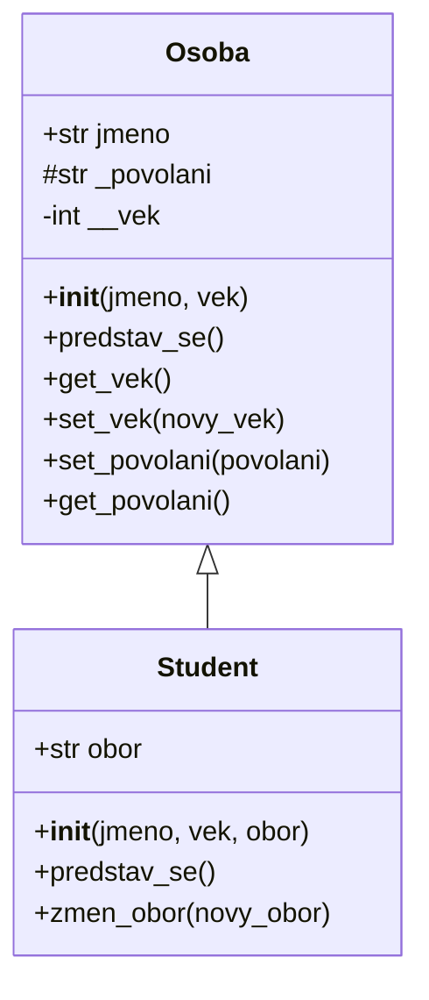

---
#== Layout
theme: default
background: https://cover.sli.dev # https://unsplash.com/collections/94734566/slidev
transition: slide-left #https://sli.dev/guide/animations#slide-transitions
mdc: true # https://sli.dev/guide/syntax#mdc-syntax
selectable: false
codeCopy: false
download: true
hideInToc: true

#== Code Highlighter
highlighter: shiki
lineNumbers: true

#== Dravings https://sli.dev/guide/drawing
drawings:
  persist: false

#== Export Configuration
# use export CLI options in camelCase format https://sli.dev/guide/exporting.html
export:
  format: pdf
  timeout: 30000
  dark: false
  withClicks: false

#== Slide Info
src: '../../pages/index.md'
title: "OOP Dědičnost"
exportFilename: "44_dedicnost"
titleTemplate: "PVA2 %s by Adam Fišer"
info: |
  ## PVA2 Programování a vývoj aplikací

  Určeno pouze pro výukové účely

  [Repository](https://github.com/OA-PVA2-Syllabus/prednasky) / [Prezentace](https://oa-pva2-syllabus.github.io/prednasky/)

  Created by [Adam Fišer](https://github.com/AdamFiser)
---
layout: default
---

#  Obsah

<Toc :columns="2" minDepth="1" maxDepth="1"></Toc>
---

# Dědičnost

- Dědičnost je základním prvkem objektově orientovaného programování
- Umožňuje vytvářet nové třídy na základě již existujících
- Nová třída může převzít vlastnosti a metody již existující třídy

---

# Syntaxe dědičnosti

- Dědičnost se definuje v závorce za názvem třídy
- V závorce se uvádí název třídy, ze které se dědí
- Třída, ze které se dědí, se nazývá rodičovská třída (rodič)
- Třída, která dědí, se nazývá potomkovská třída (potomek)

```python
class Rodic:
    def __init__(self, jmeno):
        self.jmeno = jmeno
```

```python
class Potomek(Rodic):
    def __init__(self, jmeno, vek):
        # Volání konstruktoru rodiče
        super().__init__(jmeno)
        self.vek = vek
```

---

# Volání konstruktoru rodiče

- Konstruktor rodiče se volá pomocí funkce `super()`
- Funkce `super()` vrací objekt rodiče
- Pomocí `super().__init__()` voláme konstruktor rodiče
- Tím inicializujeme vlastnosti rodiče

---

# Příklad dědičnosti

```python
class Rodic:
    def __init__(self, jmeno):
        self.jmeno = jmeno
```

```python
class Potomek(Rodic):
    def __init__(self, jmeno, vek):
        super().__init__(jmeno)
        self.vek = vek
```

```python
potomek = Potomek("Adam", 30)
print(potomek.jmeno)
print(potomek.vek)
```

---

# Polymorfismus

- Polymorfismus je schopnost objektu měnit své chování na základě kontextu
- Polymorfní objekty mohou mít stejné metody, ale chovat se odlišně
- Například metoda `info()` může vracet různé informace
- Polymorfismus zvyšuje flexibilitu a znovupoužitelnost kódu


Například:

```python
class Auto:
    def info(self):
        return "Auto"
```

```python
class Motorka(Auto):
    def info(self):
        return "Motorka"
```

```python
auto = Auto()
motorka = Motorka()
print(auto.info())
print(motorka.info())
```

---
layout: image-right
image: https://cover.sli.dev
---

# Komplexní příklad

---

# Diagram


---

# Kód

```python {*|1|2-5|7-8|10-25|28-32|34-40|7-8,34-36|43-52}{maxHeight:'400px'}
class Osoba:
    def __init__(self, jmeno, vek):
        self.jmeno = jmeno
        self._povolani = "nezaměstnaný"  # Chráněný atribut
        self.__vek = vek  # Soukromý atribut

    def predstav_se(self):
        return f"Ahoj, jmenuji se {self.jmeno} a je mi {self.__vek} let."

    def get_vek(self):
        return self.__vek

    def set_vek(self, novy_vek):
        if novy_vek > 0:
            self.__vek = novy_vek
            return f"Věk byl změněn na {self.__vek}."
        else:
            return "Věk musí být kladné číslo!"

    def set_povolani(self, povolani):
        self._povolani = povolani
        return f"Povolání bylo nastaveno na {self._povolani}."

    def get_povolani(self):
        return self._povolani


class Student(Osoba):
    def __init__(self, jmeno, vek, obor):
        super().__init__(jmeno, vek)
        self.obor = obor
        self.set_povolani("student")

    def predstav_se(self):
        vystup = super().predstav_se()
        return vystup + f" a studuji obor {self.obor}."

    def zmen_obor(self, novy_obor):
        self.obor = novy_obor
        return f"Nový obor je nyní {self.obor}."


# Použití tříd
student = Student("Lorenz", 20, "Informatika")

# Všechny metody nyní vrací řetězce, které můžeme vypsat pomocí print
print(student.predstav_se())
print("Věk:", student.get_vek())
print(student.set_vek(21))
print("Nový věk:", student.get_vek())
print(student.zmen_obor("Matematika"))
print("Povolání:", student.get_povolani())
```

---

# Shrnutí

- - Dědičnost umožňuje znovupoužití kódu a rozšiřování funkcionality.
- `super()` umožňuje volání metod rodičovské třídy.
- Přepisování metod dovoluje upravit chování potomků.


---
src: '../../pages/thanku.md'
---