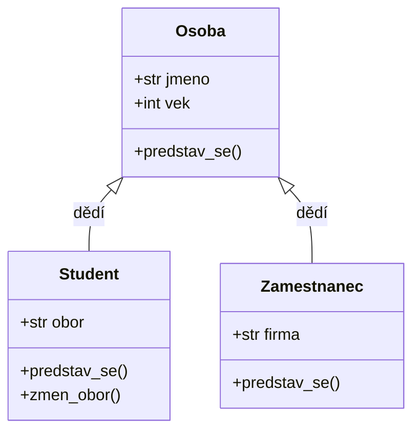
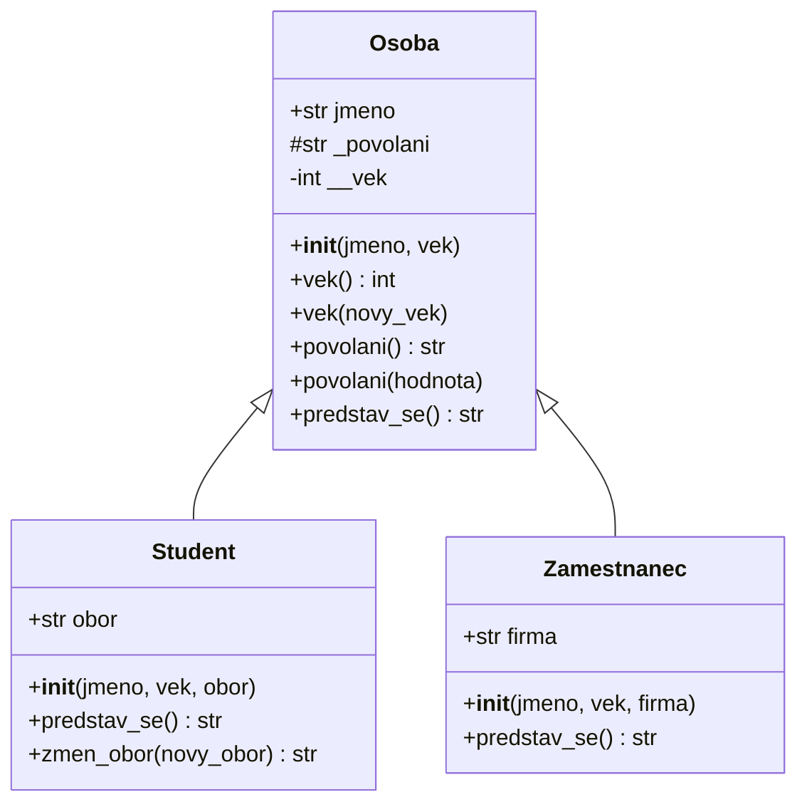

---
#== Layout
theme: default
background: https://cover.sli.dev
transition: slide-left
mdc: true
selectable: false
codeCopy: false
download: true
hideInToc: true

#== Code Highlighter
highlighter: shiki
lineNumbers: true

#== Drawings https://sli.dev/guide/drawing
drawings:
  persist: false

#== Export Configuration
export:
  format: pdf
  timeout: 30000
  dark: false
  withClicks: false

#== Slide Info
src: '../../pages/index.md'
title: "OOP Dědičnost"
exportFilename: "44_dedicnost"
titleTemplate: "PVA2 %s by Adam Fišer"
info: |
  ## PVA2 Programování a vývoj aplikací

  Určeno pouze pro výukové účely

  [Repository](https://github.com/OA-PVA2-Syllabus/pva2_prednasky) / [Prezentace](https://oa-pva2-syllabus.github.io/pva2_prednasky/)

  Created by [Adam Fišer](https://github.com/AdamFiser)
---
layout: default
---

# Obsah

<Toc :columns="2" minDepth="1" maxDepth="1"></Toc>

---

# Proč dědičnost?

Bez dědičnosti se stejný kód opakuje v každé třídě — **duplicita je problém**.

<div class="grid grid-cols-2 gap-6 mt-4">
<div>

**❌ Bez dědičnosti**

```python {filename:'bez_dedicnosti.py'}
class Student:
    def __init__(self, jmeno, vek):
        self.jmeno = jmeno   # duplicita
        self.vek = vek       # duplicita

    def predstav_se(self):   # duplicita
        return f"Jsem {self.jmeno}."

class Zamestnanec:
    def __init__(self, jmeno, vek):
        self.jmeno = jmeno   # duplicita
        self.vek = vek       # duplicita

    def predstav_se(self):   # duplicita
        return f"Jsem {self.jmeno}."
```

</div>
<div>

**✅ S dědičností**

```python {filename:'s_dedicnosti.py'}
class Osoba:
    def __init__(self, jmeno, vek):
        self.jmeno = jmeno
        self.vek = vek

    def predstav_se(self):
        return f"Jsem {self.jmeno}."


class Student(Osoba):
    pass   # zdědí vše od Osoby


class Zamestnanec(Osoba):
    pass   # zdědí vše od Osoby
```

</div>
</div>

---
layout: two-cols-header
---

# Dědičnost

::left::

- Dědičnost je základním prvkem objektově orientovaného programování
- Umožňuje vytvářet nové třídy na základě již existujících
- Potomek **přebírá** atributy a metody rodiče
- Potomek může atributy a metody **rozšiřovat** nebo **přepisovat**

::right::


```mermaid {theme: 'default', scale: 0.82}
classDiagram
    class Osoba {
        +str jmeno
        +int vek
        +predstav_se()
    }
    class Student {
        +str obor
        +predstav_se()
        +zmen_obor()
    }
    class Zamestnanec {
        +str firma
        +predstav_se()
    }
    Osoba <|-- Student : dědí
    Osoba <|-- Zamestnanec : dědí
```

---

# Terminologie

| Pojem | Synonyma | Popis |
|---|---|---|
| **Rodičovská třída** | Základní třída, Předek, *Base class* | Třída, ze které se dědí |
| **Potomkovská třída** | Odvozená třída, Podtřída, *Derived class* | Třída, která dědí |

```python {filename:'priklad.py'}
class Rodic:            # rodičovská třída (base class)
    pass

class Potomek(Rodic):  # potomkovská třída — dědí od Rodic
    pass
```

---

# Syntaxe dědičnosti

- Název rodičovské třídy se uvádí **v závorce** za názvem třídy potomka

```python {filename:'rodic.py'}
class Rodic:
    def __init__(self, jmeno):
        self.jmeno = jmeno

    def pozdrav(self):
        return f"Ahoj, jsem {self.jmeno}."
```
 
-

```python {filename:'potomek.py'}
class Potomek(Rodic):
    def __init__(self, jmeno, vek):
        super().__init__(jmeno)   # volání konstruktoru rodiče
        self.vek = vek
```

-

```python {filename:'main.py'}
p = Potomek("Anna", 20)
print(p.pozdrav())   # Zdědeno od Rodic → "Ahoj, jsem Anna."
print(p.vek)         # Vlastní atribut potomka → 20
```

---

# Volání konstruktoru rodiče – `super()`

- `super()` vrací odkaz na rodičovskou třídu
- `super().__init__(...)` inicializuje atributy definované v rodiči
- **Bez volání `super()` by atributy rodiče nebyly inicializovány!**

<div class="grid grid-cols-2 gap-6 mt-2">
<div>

**✅ Správně — s `super()`**

```python {filename:'potomek.py'}
class Potomek(Rodic):
    def __init__(self, jmeno, vek):
        super().__init__(jmeno)
        # ✅ self.jmeno je inicializováno
        self.vek = vek

p = Potomek("Anna", 20)
print(p.jmeno)   # "Anna"
print(p.vek)     # 20
```

</div>
<div>

**❌ Špatně — bez `super()`**

```python {filename:'potomek_spatne.py'}
class Potomek(Rodic):
    def __init__(self, jmeno, vek):
        # ❌ self.jmeno není inicializováno!
        self.vek = vek

p = Potomek("Anna", 20)
print(p.jmeno)   # AttributeError!
print(p.vek)     # 20
```

</div>
</div>

---

# Modifikátory přístupu

Python vyjadřuje přístupnost atributů **konvencí pojmenování**:

| Zápis | Typ | Přístupnost |
|---|---|---|
| `self.jmeno` | **Veřejný** (public) | Přístupný odkudkoliv |
| `self._jmeno` | **Chráněný** (protected) | V třídě a jejích potomcích |
| `self.__jmeno` | **Soukromý** (private) | Pouze uvnitř dané třídy |


```python {filename:'osoba.py'}
class Osoba:
    def __init__(self, jmeno, vek):
        self.jmeno = jmeno               # public   — přístupný odkudkoliv
        self._povolani = "nezaměstnaný"  # protected — přístup v třídě a potomcích
        self.__vek = vek                 # private   — přístupný jen uvnitř třídy
```

```python {filename:'main.py'}
o = Osoba("Karel", 30)
print(o.jmeno)       # ✅ public — vždy funguje
print(o._povolani)   # ⚠️ protected — funguje, ale porušuje konvenci
print(o.__vek)       # ❌ AttributeError — soukromý, nelze přistoupit přímo
```

---

# Gettery a settery přes modifikátory – `@property`

- Soukromé atributy (`__`) je nutné číst a zapisovat přes **getter** a **setter**
- Pythonický způsob: dekorátor `@property`
- Zvenku vypadá jako přímý přístup k atributu, ale uvnitř umožňuje **validaci**

```python {*|2-4|6-11|13-15|17-19}{maxHeight:'340px', filename:'osoba.py'}
class Osoba:
    @property
    def vek(self):
        return self.__vek              # getter — čte soukromý atribut

    @vek.setter
    def vek(self, novy_vek):
        if novy_vek > 0:
            self.__vek = novy_vek     # setter — zapíše po validaci
        else:
            raise ValueError("Věk musí být kladné číslo!")

    @property
    def povolani(self):
        return self._povolani         # getter pro chráněný atribut

    @povolani.setter
    def povolani(self, hodnota):
        self._povolani = hodnota
```

---

# Gettery a settery

```python {filename:'main.py'}
o = Osoba("Karel", 30)
print(o.vek)   # ✅ volá getter — vypadá jako atribut
o.vek = 31     # ✅ volá setter — vypadá jako přiřazení
o.vek = -5     # ❌ ValueError: Věk musí být kladné číslo!
```

---
layout: image-right
image: https://cover.sli.dev
---

# Polymorfismus

---
layout: two-cols-header
---

# Polymorfismus

> Polymorfismus je obecný OOP princip, který znamená „mnoho podob".
> Umožňuje objektům se chovat různě na základě jejich typu,
> přitom se používá stejný interface (stejné jméno metody).

- Polymorfismus = „mnoho forem"
- Různé třídy mohou mít **stejně pojmenovanou metodu**, která se chová odlišně
- Python automaticky volá **správnou verzi** metody podle skutečného typu objektu

::left::

```python {filename:'osoby.py'}
class Osoba:
    def predstav_se(self):
        return f"Jsem osoba: {self.jmeno}."

class Student(Osoba):
    def predstav_se(self):
        return f"Jsem student: {self.jmeno}, obor {self.obor}."

class Zamestnanec(Osoba):
    def predstav_se(self):
        return f"Jsem zaměstnanec: {self.jmeno}, firma {self.firma}."
```

::right::

```python {filename:'main.py'}
osoby = [
    Osoba("Karel", 50),
    Student("Anna", 20, "Informatika"),
    Zamestnanec("Petr", 40, "TechCorp"),
]

for osoba in osoby:
    print(osoba.predstav_se())   # Python volá správnou verzi automaticky!
```

---

# Přepisování metod (Method Overriding)

> Overriding je konkrétní mechanismus, jak polymorfismus dosáhnout. Potomek definuje metodu se stejným jménem a signaturou jako rodič, čímž ji "přepíše".

- Potomek může **přepsat** metodu rodiče — stejný název, jiné tělo
- Původní metodu rodiče lze stále zavolat přes `super()`

```python {filename:'osoba.py'}
class Osoba:
    def predstav_se(self):
        return f"Ahoj, jsem {self.jmeno}."
```

```python {filename:'student.py'}
class Student(Osoba):
    def predstav_se(self):                 # přepisuje metodu rodiče
        zaklad = super().predstav_se()     # nejprve zavolá metodu rodiče
        return zaklad + f" Studuji {self.obor}."
```

```python {filename:'main.py'}
o = Osoba("Karel", 30)
s = Student("Anna", 20, "Informatika")

print(o.predstav_se())   # "Ahoj, jsem Karel."
print(s.predstav_se())   # "Ahoj, jsem Anna. Studuji Informatika."
```

---

# Příklad overridingu

```python
# Nadtřída - definuje interface
class Zvire:
    def zvi(self):
        return "Nějaký zvuk"

# Potomci - přepisují metodu
class Pes(Zvire):
    def zvi(self):
        return "Haf haf!"

class Kocka(Zvire):
    def zvi(self):
        return "Mňau!"

# Polymorfismus v akci
zvira = [Pes(), Kocka(), Pes()]
for zvire in zvira:
    print(zvire.zvi())  # Každý typ se chová jinak!
# Výstup:
# Haf haf!
# Mňau!
# Haf haf!
```

---
layout: image-right
image: https://cover.sli.dev
---

# Pomocné funkce

---

# `isinstance()` a `issubclass()`

Pomocné funkce pro práci s typy a dědičností za běhu programu:

```python {filename:'main.py'}
student = Student("Anna", 20, "Informatika")

# isinstance — zjistí, zda je objekt instancí dané třídy
isinstance(student, Student)    # True  — přímá instance třídy Student
isinstance(student, Osoba)      # True  — potomek je zároveň instancí předka!
isinstance(student, int)        # False — není int

# issubclass — zjistí vztah dědičnosti mezi třídami (nikoli objekty)
issubclass(Student, Osoba)      # True  — Student dědí od Osoba
issubclass(Osoba, Student)      # False — Osoba nedědí od Student
```

> 💡 `isinstance()` je klíčový při polymorfismu — umožňuje reagovat na skutečný typ objektu, i když pracujeme s kolekcí různých potomků.

---
layout: image-right
image: https://cover.sli.dev
---

# Komplexní příklad

---

# Diagram


```mermaid {theme: 'default', scale: 0.72}
classDiagram
    class Osoba {
        +str jmeno
        #str _povolani
        -int __vek
        +__init__(jmeno, vek)
        +vek() int
        +vek(novy_vek)
        +povolani() str
        +povolani(hodnota)
        +predstav_se() str
    }

    class Student {
        +str obor
        +__init__(jmeno, vek, obor)
        +predstav_se() str
        +zmen_obor(novy_obor) str
    }

    class Zamestnanec {
        +str firma
        +__init__(jmeno, vek, firma)
        +predstav_se() str
    }

    Osoba <|-- Student
    Osoba <|-- Zamestnanec
```

---

# Kód – třída `Osoba`

```python {*|2-5|7-16|18-24|26-27}{maxHeight:'420px', filename:'osoba.py'}
class Osoba:
    def __init__(self, jmeno, vek):
        self.jmeno = jmeno                   # public
        self._povolani = "nezaměstnaný"      # protected
        self.__vek = vek                     # private

    @property
    def vek(self):
        return self.__vek

    @vek.setter
    def vek(self, novy_vek):
        if novy_vek > 0:
            self.__vek = novy_vek
        else:
            raise ValueError("Věk musí být kladné číslo!")

    @property
    def povolani(self):
        return self._povolani

    @povolani.setter
    def povolani(self, hodnota):
        self._povolani = hodnota

    def predstav_se(self):
        return f"Ahoj, jmenuji se {self.jmeno} a je mi {self.__vek} let."
```

---

# Kód – třídy `Student` a `Zamestnanec`

```python {*|1-12|15-22}{maxHeight:'400px', filename:'student_zamestnanec.py'}
class Student(Osoba):
    def __init__(self, jmeno, vek, obor):
        super().__init__(jmeno, vek)
        self.obor = obor
        self.povolani = "student"          # setter z rodiče přes @property

    def predstav_se(self):
        return super().predstav_se() + f" Studuji obor {self.obor}."

    def zmen_obor(self, novy_obor):
        self.obor = novy_obor
        return f"Nový obor je nyní {self.obor}."


class Zamestnanec(Osoba):
    def __init__(self, jmeno, vek, firma):
        super().__init__(jmeno, vek)
        self.firma = firma
        self.povolani = "zaměstnanec"      # setter z rodiče přes @property

    def predstav_se(self):
        return super().predstav_se() + f" Pracuji ve firmě {self.firma}."
```

---

# Kód – použití a polymorfismus

```python {*|1-2|5-7|10-12|15-17|20-21}{maxHeight:'380px', filename:'main.py'}
student = Student("Anna", 20, "Informatika")
zam = Zamestnanec("Petr", 35, "TechCorp")

# getter a setter přes @property
print(student.vek)      # 20  — getter
student.vek = 21        # setter s validací
# student.vek = -1      # ❌ ValueError: Věk musí být kladné číslo!

# přepisování metod
print(student.predstav_se())
# → "Ahoj, jmenuji se Anna a je mi 21 let. Studuji obor Informatika."
print(zam.predstav_se())
# → "Ahoj, jmenuji se Petr a je mi 35 let. Pracuji ve firmě TechCorp."

# polymorfismus — stejné volání, různé chování
for o in [student, zam]:
    print(type(o).__name__, "→", o.predstav_se())

# isinstance — zjistí typ za běhu
print(isinstance(student, Osoba))    # True — potomek je i instancí předka
print(isinstance(student, Student))  # True
```

---

# Shrnutí

- **Dědičnost** eliminuje duplicitu kódu a umožňuje rozšiřovat existující třídy
- Název rodičovské třídy se uvádí **v závorce** za názvem potomka
- `super().__init__()` inicializuje atributy rodičovské třídy — bez něj chybí!
- **Modifikátory přístupu** (`public`, `_protected`, `__private`) řídí viditelnost atributů
- **`@property`** je pythonický způsob tvorby getterů a setterů s možností validace
- **Přepisování metod** (method overriding) umožňuje změnit chování v potomkovi
- **Polymorfismus** — různé třídy, stejné rozhraní, různé chování za běhu programu
- **`isinstance()`** ověří, zda objekt patří do dané třídy nebo jejího předka

---
src: '../../pages/thanku.md'
---